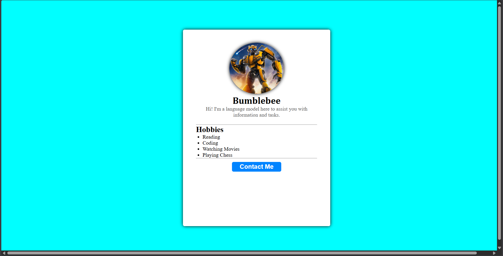

# Web-Task1-
A collection of beginner to advanced HTML &amp; CSS practice tasks and mini projects for improving front-end development skills.

# HTML & CSS Practice Projects 🚀

This repository contains a structured set of practice tasks and mini projects built using **HTML and CSS**.  
It is designed to help beginners and intermediate developers strengthen their front-end development skills through hands-on practice.

---

## 🛠️ Technologies Used
- HTML5  
- CSS3

---

## 🎯 Goal
To practice modern UI design and layout concepts while building real-world front-end components from scratch.

---

## 📌 How to Use
1. Clone the repository  
2. Open any project folder  
3. Run the `.html` file in your browser  
4. Practice, modify, and improve the design

---

### HTML
```
<!DOCTYPE html>
<html lang="en">
<head>
    <meta charset="UTF-8">
    <meta name="viewport" content="width=device-width, initial-scale=1.0">
    <title>Profile</title>
    <link rel="stylesheet" href="./task1.css">
</head>
<body>
    <div class="outer">
        <div class="card">
            
            <h3>Bumblebee</h3>
            <div class="para">Hi! I'm a language model here to assist you with information and tasks.</div>

            <hr>

            <h2>Hobbies</h2>

            <ul>
                <li>Reading</li>
                <li>Coding</li>
                <li>Watching Movies</li>
                <li>Playing Chess</li>
            </ul>

            <hr>
            
            <div class="foot">
            <button>Contact Me</button>
            </div>
        </div>
    </div>
</body>
</html>
```
---

### CSS

```
*{
    margin: 0;
    padding: 0;
    box-sizing: border-box;
}

.outer{
    background-color: aqua;
    height: 100vh;
    width: 200vh;

    display: flex;
    align-items: center;
    justify-content: center;
}

.card{
    width: 450px;
    height: 600px;
    background-color: white;
    border-radius: 5px;
    text-align: center;
    padding: 40px;
    box-shadow: 0 0 10px black;
}

img{
    width: 45%;
    height: 30%;
    border-radius: 100%;
    object-fit: cover;
    box-shadow: 0 0 10px black;

}

h3{
    text-align: center;
    font-size: 28px;
    font-weight: bolder;
    font-family: Cambria, Cochin, Georgia, Times, 'Times New Roman', serif;
}

.para{
    color: #555;
    margin-bottom: 20px;
}

h2{
    color: black;
    text-transform: capitalize;
    text-align: left;
}

ul{
    text-align: left;
    padding-left: 20px;
}

button{
    background-color: rgb(0, 132, 255);
    color: white;
    border-radius: 5px;
    width: 150px;
    height: 30px;
    border: none;
    font-size: larger;
    font-weight: bolder;

}

.foot{
    padding-top: 10px;
    justify-content: space-around;
}

```

## 📷 Preview

  


###                 THANK YOU
